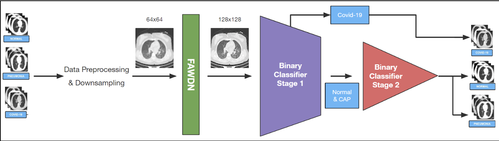

# SRCT COVID19 Classification 2023
### Project for CAP 5516 by Melody Halbert and Ethan Legum

The use of deep learning provides automated approaches to medical image analysis and is valuable for COVID-19 detection. 
This project focuses on the use of super-resolution to reconstruct high-quality CT images from under-sampled data. 
Our proposed method utilizes a prior super-resolution network to reconstruct high-resolution CT scans and a simple
two-stage binary classifier to classify COVID, pneumonia, and normal samples. By leveraging low-resolution scans, 
our approach aims to enable the use of lower-kilovoltage CT scans in practice while maintaining competitive 
classification accuracies.



The above figure depicts our method, which comprises the following steps: 
- Resizing and augmenting COVID-19 data samples
- FAWDN super-resolution process
- Two-phase binary classification approach as defined by Hasija et al. [1]. 

Our implementation of a two-phase binary classification approach, as opposed to a multi-class approach, 
aims to enables more efficient performance by utilizing two simple CNNs. 
This approach offers advantages such as enabling us to allocate more time 
and computational resources towards image super-resolution and processing low-dimensional data.

## How to begin:

In /two_phase you will find two jupyter notebooks, used for easy training of each phase
of the binary classification process. Run each script and train to output your models. 
These models will need to be accessed in lines 189 and 191 of main.py.

Pretrained models for FAWDN SR are found in /models and implemented in our scripts already.

## Testing

### Method 1 (Recommended):
Running cloned git repo in a Kaggle notebook. Any personal changes to our scripts can 
be pushed to your forked repo and git pull-ed on Kaggle. 
```
   # Kaggle Cell Example:
   !git clone ./COVID19_SR_BinaryClassification.git
   !python /kaggle/working/COVID19_SR_BinaryClassification/main.py 
```

Important paths for Kaggle usage (in main.py):
```
    path_64 = '/kaggle/working/64res/'
    path_128 = '/kaggle/working/128res/'
    fawdn_out = '/kaggle/working/MyImage/FAWDN/x2'
```

### Method 2:
Start running the SR and two-phase classification pipeline by running main.py. 
```
   $ python main.py
```
The critical portion of this method is ensuring your local pathing is correct. There is
many steps of data preprocessing and outputting into directories due to the SR step. 
important paths for local system usage (in main.py):
```
    # change these paths to resemble your working directory
    path_64 = '64res/'
    path_128 = '128res/'
    fawdn_out = 'MyImage/FAWDN/x2'
```


## Credits

- This project's SR code base is based upon FAWDN: 'Feedback Adversarial Weighting Dense Network' [1] found at https://github.com/Paper99/SRFBN_CVPR19 
and uses pretrained medical imaging models avaliable through https://github.com/Lihui-Chen/FAWDN
- This project's two-phase binary classification is based upon Sanskar et al. 'A novel approach for detection of COVID-19 and Pneumonia using only binary classification from chest CT-scans' [2]. 
Original code can be found at: https://github.com/sanskar-hasija/COVID-19_Detection
- We utlize the COVIDxCT 3A dataset accessible via Kaggle. https://www.kaggle.com/datasets/hgunraj/covidxct

## 
[1] J. Hu, L. Shen, and G. Sun, "Feedback Network for Image Super-Resolution," in IEEE Conference on Computer Vision and Pattern Recognition (CVPR), 2016, pp. 3188-3196.

[2] Sanskar, H., et al., A novel approach for detection of COVID-19 and Pneumonia using only binary classification from chest CT-scans. Neuroscience Informatics, Volume 2, Issue 4. 2022. 100069. ISSN 2772-5286. [Online]. Accessible: https://doi.org/10.1016/j.neuri.2022.100069.


